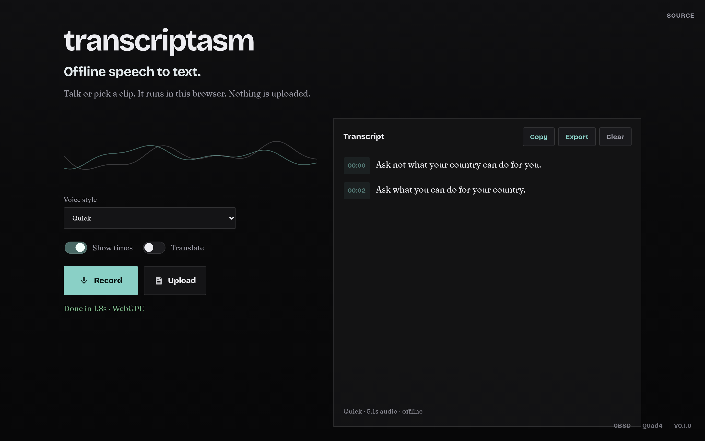

# transcriptasm

[](https://github.com/Quad4-Software/transcriptasm/actions/workflows/ci.yml) [](https://scorecard.dev/viewer/?uri=github.com/Quad4-Software/transcriptasm) [](https://github.com/Quad4-Software/transcriptasm/releases) [](https://github.com/Quad4-Software/transcriptasm/blob/master/LICENSE) [](https://go.dev/dl/) [](https://transcriptasm.quad4.io) [](https://github.com/orgs/Quad4-Software/packages/container/package/transcriptasm) [](https://transcriptasm.quad4.io)

Offline speech-to-text in the browser via Whisper WASM. Nothing is uploaded.

**Live:** [https://transcriptasm.quad4.io](https://transcriptasm.quad4.io)



Whisper weights, ONNX hybrids, and transformers.js are **not** in git. The Docker image downloads them at build time and ships a full offline stack. For a local source build, run `make assets` once (custom whisper WASM is already under `web/vendor/whisper/`).

## Install (Docker)

Clone and build (downloads all models/WASM into the image):

```bash
git clone https://github.com/Quad4-Software/transcriptasm.git
cd transcriptasm
docker compose up --build
```

Open [http://127.0.0.1:8080](http://127.0.0.1:8080).

Pre-built multi-arch image (`linux/amd64`, `linux/arm64`):

```bash
docker pull ghcr.io/quad4-software/transcriptasm:latest
docker run --rm -p 8080:8080 ghcr.io/quad4-software/transcriptasm:latest
```

Or with Compose against the published image:

```bash
git clone https://github.com/Quad4-Software/transcriptasm.git
cd transcriptasm
IMAGE=ghcr.io/quad4-software/transcriptasm:latest docker compose up
```

Coolify: use `docker-compose.coolify.yml` and set the domain to container port `8080`.

Bind on all interfaces: `HOST_PORT=0.0.0.0:8080 docker compose up --build`.

## Release binaries

Tagged releases publish static Go servers for Linux, Windows, macOS, FreeBSD, OpenBSD, NetBSD (amd64, arm64, arm, 386, riscv64, and other supported arches).

```bash
# example
curl -LO https://github.com/Quad4-Software/transcriptasm/releases/latest/download/transcriptasm_X.Y.Z_linux_amd64.tar.gz
tar xzf transcriptasm_*.tar.gz
./transcriptasm -web /path/to/web -addr :8080
```

The binary serves a `web/` tree. For a full offline tree, clone the repo and run `make assets`, or use the container image (recommended).

## Build from source

Needs Go 1.26+ and Node (for tests).

```bash
git clone https://github.com/Quad4-Software/transcriptasm.git
cd transcriptasm
make assets
make build
make run
```

```bash
make test
make check
```

Binary: `bin/transcriptasm` (default listen `:8080`, web root `web`).

Regenerate whisper WASM (needs emsdk): `make whisper-wasm`.

## Screenshots

Capture desktop, mobile, and OG shots into `docs/screenshots/`:

```bash
make screenshots
```

Or point at a running instance:

```bash
SCREENSHOT_BASE_URL=http://127.0.0.1:8080 make screenshots
SCREENSHOT_BASE_URL=https://transcriptasm.quad4.io bash scripts/screenshot.sh
```

Reusable tool: `scripts/screenshot/capture.mjs` (Playwright). CI uploads PNGs from the Screenshots workflow.

## License

0BSD
